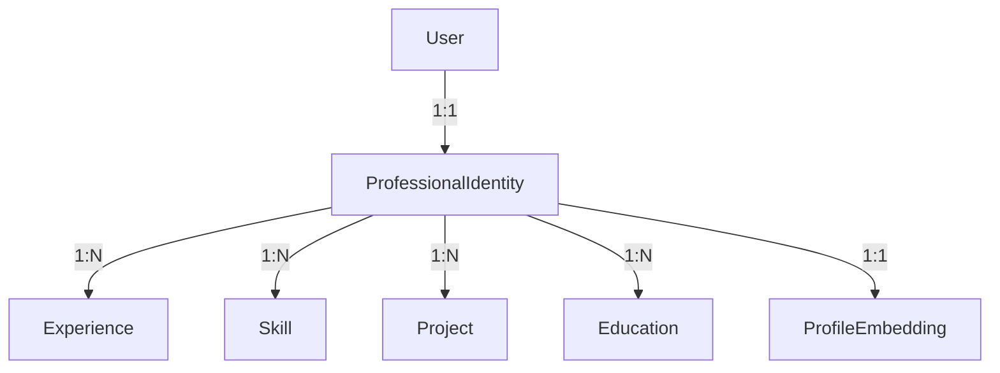

# CareerOS Database Design Documentation

This document provides a comprehensive overview of the CareerOS database architecture, focusing on the PostgreSQL implementation with `pgvector` for AI-native capabilities.

---

## 1. Architectural Overview

CareerOS utilizes a **5-Layer Data Architecture** designed for high-performance operational tasks, deep professional identity modeling, and AI-driven intelligence.

| Layer | Name | Purpose | Key Insight |
|-------|------|---------|------------|
| **1** | **Operational** | Platform operations & transactions | System of Record |
| **2** | **Professional Graph** | Rich career history & portable equity | Identity Engine |
| **3** | **Intelligence** | Match reasoning & market signals | Reasoning Layer |
| **4** | **Vector (pgvector)** | Semantic embeddings for similarity | AI-Native Search |
| **5** | **MCP / Agent** | Autonomous agent state & memory | Reasoning Execution |

---

## 2. Layer 4: Vector Layer (pgvector)

The Vector Layer is the core of CareerOS's "AI-native" search and matching capabilities.

### Production Environment (PostgreSQL)
In production, we use the `pgvector` extension.
- **Data Type:** `VECTOR(1536)` (Optimized for OpenAI `text-embedding-3-small` or `ada-002`)
- **Indexing:** `IVFFlat` or `HNSW` with `vector_cosine_ops` for fast semantic retrieval.

### Development Environment (SQLite)
During development, embeddings are stored as `JSONField` (lists of floats). Similarity operations are performed in-memory via Python/NumPy.

### Core Vector Tables

| Table | Purpose | Related Model | Embedding Model |
|-------|---------|---------------|-----------------|
| `core_profileembedding` | Semantic representation of a user | `ProfessionalIdentity` | `text-embedding-3-small` |
| `core_jobembedding` | Semantic representation of a job | `scraper.Job` | `text-embedding-3-small` |
| `core_companyembedding` | Semantic representation of a company | N/A (Name indexed) | `text-embedding-3-small` |

---

## 3. Layered Schema Details

### Layer 1: Operational Layer
The foundation for user accounts and job tracking.
- **Models:** `User` (Django Auth), `scraper.Job`, `TrackerItem`.
- **Function:** Tracks the "state" of applications (Discovered, Applied, Interviewing, Offer).

### Layer 2: Professional Graph
Enriches the simple user record into a multi-dimensional career history.
- **Central Entity:** `ProfessionalIdentity`
- **Sub-entities:**
    - `Experience`, `Education`, `Project`, `Achievement`
    - `Certification`, `Award`, `Publication`, `Patent`
    - `Skill` (with verification status)
    - `VolunteerWork`, `SpeakingEngagement`

### Layer 3: Intelligence Layer
The reasoning engine that connects Profiles to Jobs.
- **JobProfile:** AI-inferred structure of a raw job description (Seniority, Work Mode, Visa Support, Salary Bands).
- **MatchResult:** The "Why" behind a match. Includes `overall_score` (0-100) and components like `skill_match_score` and `experience_match_score`.
- **MarketSignal:** Tracks demand and salary trends for skills across regions (e.g., "Rust in US-SF").
- **VisibilityScore:** Controls how "discoverable" a candidate is to recruiters.

### Layer 5: MCP / Agent Layer
Enables autonomous AI agents to work on behalf of the user.
- **ToolInvocation:** Logs every tool call made by an agent (e.g., `search_jobs`, `refine_resume`).
- **AgentExecution:** Tracks the lifecycle of an agent's task.
- **AgentMemory:** Persistent key-value store for agent context (preferences, past feedback).

---

## 4. Professional Identity Graph Segment

The **Identity Graph** is the most complex segment, modeled as a star schema with `ProfessionalIdentity` at the center.



---

## 5. Implementation Strategy: SQLite to PostgreSQL

CareerOS uses a dual-path implementation strategy for vector search:

### SQLite (Development)
```python
# python matching
def get_similar_jobs(profile_vector, limit=10):
    embeddings = JobEmbedding.objects.all()
    # Manual cosine similarity calculation...
```

### PostgreSQL + pgvector (Production)
```sql
-- SQL matching
SELECT job_id, (embedding <=> '[0.12, 0.45, ...]') AS distance
FROM core_jobembedding
ORDER BY distance
LIMIT 10;
```

---

## 6. Maintenance & Performance

1. **Embedding Versioning:** All embedding tables include an `embedding_model` field. When switching models (e.g., Ada to 3-Small), a background task re-embeds all records.
2. **Indexing:**
    - `core_skill`: Index on `name` (case-insensitive) and `identity_id`.
    - `core_matchresult`: Compound index on `(profile_id, job_id)`.
    - `pgvector`: `IVFFlat` index for production-scale similarity search.
3. **Audit:** Every record includes `created_at` and `updated_at` for synchronization and data lineage tracking.
